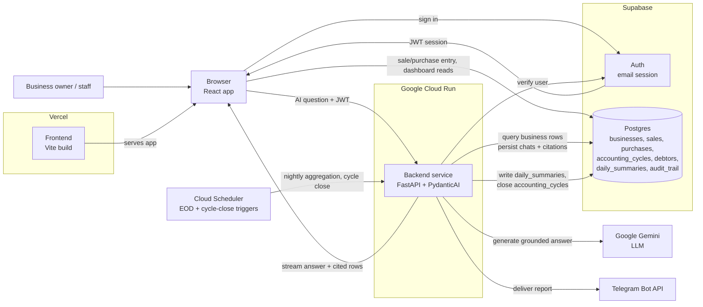

# SME Biz Analyst Architecture

## Purpose

SME Biz Analyst is a business-accounting app for small business owners. The
architecture must optimize for trust in the numbers: every dashboard figure
comes from a deterministic aggregation of the owner's own recorded
transactions, every AI answer is grounded in rows the backend actually
queried, and the system fails clearly rather than guessing when the data
doesn't support an answer.

This document adapts the Document Copilot reference architecture (typed
agent boundary, JWT-verified backend, Supabase-hosted state, streaming chat)
to a structured-accounting domain instead of a document-retrieval domain.
The single biggest architectural difference: **there are no documents to
chunk or embed.** The "retrieval" problem here is structured SQL access over
`sales`, `purchases`, `accounting_cycles`, `debtors`, and — for anything
spanning more than a day or two — the pre-computed `daily_summaries` table.
pgvector and full-text search are not part of this system.

## High-Level Architecture



## Architectural Goals

- Keep the browser thin: it renders forms, tables, and dashboards, manages
  the Supabase session, and streams AI responses.
- Keep the backend authoritative for anything that isn't plain CRUD:
  AI orchestration, grounding/citation checks, nightly aggregation, fraud
  heuristics, PDF generation, and Telegram delivery.
- **Let the frontend talk to Supabase directly for ordinary CRUD** (sales
  entry, purchases entry, product list, dashboard reads from
  `daily_summaries`) — RLS enforces tenant isolation at the database level,
  and there is no reason to proxy simple reads/writes through FastAPI. This
  mirrors the reference template's boundary rule ("dashboard reads:
  Supabase directly") but extends it to the transactional tables too, since
  none of them need document-processing-style backend logic to write.
- Reserve FastAPI for: the AI chat endpoint, the nightly EOD aggregation job,
  cycle-close + report generation, PDF rendering, and Telegram delivery.
- Use Supabase `pgvector`/full-text search: **not used in this system.** Do
  not add them speculatively; there is no unstructured corpus to index.
- Make the LLM path typed and testable with PydanticAI, same as the
  reference template, but backed by Gemini instead of OpenAI.
- Deploy the frontend to Vercel (static Vite build) and the backend to
  Google Cloud Run (stateless container, scale-to-zero), with Cloud
  Scheduler driving the nightly/cycle-close jobs — matching the PRD's stated
  hosting rationale (serverless, pay-per-use, good fit for a bursty AI +
  nightly-cron workload).

## Stack

Frontend:

- Vite + React SPA + TypeScript
- React Router
- Tailwind CSS + shadcn/ui
- Recharts for dashboard charts (income vs. expenditure, trend lines)
- `@supabase/supabase-js` for auth **and** direct CRUD against `sales`,
  `purchases`, `products`, `debtors`, and reads from `daily_summaries`

Backend:

- Python 3.12+
- FastAPI + Uvicorn
- Pydantic v2 + pydantic-settings
- PydanticAI for typed LLM orchestration, configured with a Gemini model
  (`pydantic-ai[google]` / the `google-genai` SDK) instead of OpenAI
- Supabase Python client for server-side database access
- SQLAlchemy models + Alembic migrations for schema management
- WeasyPrint for templated PDF report generation
- `httpx` for outbound HTTP (Telegram Bot API, Gemini if not using an SDK
  wrapper)
- `structlog` for structured logs

Persistence:

- Supabase Auth for email login
- Supabase Postgres per `docs/schema.sql`: `businesses`, `users`, `products`,
  `sales`, `purchases`, `accounting_cycles`, `debtors`, `daily_summaries`,
  `audit_trail`

Scheduled jobs:

- Google Cloud Scheduler calling secured FastAPI endpoints for nightly
  `daily_summaries` aggregation and cycle-close/report generation

Notifications:

- Telegram Bot API only for MVP (per the PRD; WhatsApp/email are Phase 2+)

## System Boundaries

The frontend owns user interaction, local UI state, direct Supabase CRUD for
transactional data, and dashboard reads from `daily_summaries`. It never
holds the Supabase service-role key and never calls Gemini directly.

The backend owns: AI question answering (retrieval-over-structured-data +
grounding + streaming), the nightly aggregation job, cycle-close processing,
PDF rendering, and Telegram delivery. It is the only service allowed to use
the Supabase service-role key, and the only service allowed to call Gemini.

Supabase owns authentication and durable product state, with RLS enforcing
that a user only ever sees rows for their own `business_id`.

## Request Flow — AI question

1. The owner signs in with Supabase email auth in the React app.
2. The owner opens the AI assistant (a chat drawer available from any
   screen) and asks a question.
3. The frontend sends the question plus the Supabase access token to
   `POST /chat/stream` on FastAPI.
4. FastAPI verifies the token with Supabase Auth before doing any query or
   LLM work, and resolves the caller's `business_id`.
5. A PydanticAI agent, scoped to that `business_id`, calls bounded tools —
   `query_daily_summary`, `query_sales`, `query_purchases`,
   `query_debtors` — to fetch the specific rows needed to answer the
   question. The agent does not generate free-form SQL against the
   database; tools take typed, validated arguments (date ranges, cycle IDs)
   and return typed rows.
6. For anything spanning more than a couple of days, tools query
   `daily_summaries` instead of raw `sales`/`purchases` rows, to keep token
   usage and latency down — this is the accounting-domain equivalent of the
   reference template's "query the pre-computed layer, not raw history."
7. Gemini generates a grounded answer citing the specific rows/dates
   returned by the tools.
8. FastAPI streams the answer back in AI-SDK-compatible message parts and
   persists the user message, assistant message, and cited-row references.

## Request Flow — nightly cycle processing

1. Cloud Scheduler calls a secured FastAPI endpoint at day-end (per
   business timezone, or a fixed UTC time for MVP).
2. FastAPI aggregates that day's `sales` and `purchases` into a
   `daily_summaries` upsert (total sales, total purchases, net,
   transaction count, unique customers, top item).
3. If the aggregation also closes an `accounting_cycles` row (e.g. end of
   week/month depending on the business's configured `period_type`),
   FastAPI computes the closing balance or accrued debt and opens the next
   cycle with the carried-forward figure.
4. FastAPI asks Gemini for a short narrative summary of the closed period,
   built only from the aggregated `daily_summaries`/`accounting_cycles`
   rows — never raw transaction dumps.
5. FastAPI renders a PDF (WeasyPrint) and sends the narrative + PDF via the
   Telegram Bot API to the business's configured chat ID.

## Backend Modules

```text
backend/app/
├── api/
│   ├── chat.py                 # POST /chat/stream
│   └── reports.py              # Scheduler-triggered EOD + cycle-close endpoints
├── auth/
│   └── dependencies.py         # Supabase JWT verification, get_current_user
├── chat/
│   ├── orchestrator.py         # Coordinates one chat turn end-to-end
│   ├── messages.py             # AI SDK message conversion
│   └── streaming.py            # AI SDK-compatible streaming events
├── assistant/
│   ├── agent.py                # PydanticAI agent, Gemini model
│   ├── deps.py                 # Runtime deps: business_id, analytics client
│   ├── outputs.py               # GroundedAnswer, RowCitation
│   ├── tools.py                # query_daily_summary, query_sales, query_purchases, query_debtors
│   └── instructions.md         # Product contract (cite rows, never invent, never write)
├── analytics/
│   ├── queries.py              # Typed SQL query builders over the accounting tables
│   ├── aggregator.py           # Nightly daily_summaries + cycle-close logic
│   └── anomaly.py              # Fraud/anomaly heuristics over audit_trail + sales/purchases
├── grounding/
│   └── validator.py            # Every cited figure maps to a row the tools actually returned
├── reporting/
│   ├── pdf.py                  # WeasyPrint templated report rendering
│   └── telegram.py             # Telegram Bot API delivery
└── database/
    ├── supabase.py             # User-scoped + service-role clients
    ├── models/                 # SQLAlchemy models — one file per table in schema.sql
    └── ...                     # Query helpers per table
```

This replaces the reference template's `retrieval/` (pgvector + full-text +
RRF fusion) with `analytics/` (typed queries over structured accounting
tables) and its `ingest/` (document chunking/embedding) with
`analytics/aggregator.py` (nightly rollups) — there is no ingestion pipeline
in this system because there is no external corpus.

```python
@dataclass
class BusinessAgentDeps:
    user_id: str
    business_id: str
    analytics: AnalyticsClient


class RowCitation(BaseModel):
    table: str            # "sales" | "purchases" | "daily_summaries" | "debtors"
    row_id: str
    date: date
    summary: str          # short human-readable description of the cited row


class GroundedAnswer(BaseModel):
    answer: str
    citations: list[RowCitation]
```

The agent's instructions encode the product contract from
`docs/product-brief.md`:

- Answer only from rows returned by tool calls for this business.
- Cite every figure with the specific row(s) or summary period it came from.
- If the data doesn't support an answer, say so — never estimate or infer
  missing figures.
- Never write to the ledger. The agent has no insert/update/delete tools.
- Flag, but do not silently correct, anything that looks like a data-entry
  or fraud anomaly.

## Grounding and Citation Policy

- Every assistant answer has at least one row citation, unless it explicitly
  says the data doesn't support an answer.
- Every citation maps to a row actually returned by a tool call in that
  request — the agent cannot cite a sale it didn't query.
- Citations carry enough detail (table, date, short summary) for the
  frontend to show "this comes from your sales on 3 July" style
  provenance, mirroring the reference template's source-passage panel but
  for ledger rows instead of filing excerpts.
- If grounding validation fails, the backend returns a controlled failure,
  not a polished unsupported answer.

## Fraud / Anomaly Detection

`analytics/anomaly.py` runs against `audit_trail` plus `sales`/`purchases` on
a schedule (part of the nightly job) and flags:

- Price overrides significantly above/below a product's `default_price`.
- Entries deleted shortly after creation.
- Transactions entered outside normal operating hours.
- Unusual quantity spikes relative to a product's recent history.
- New vendors/customers added by non-admin users.

Flagged rows get `is_flagged = true` on `sales`/`purchases`. This is
rules-based for MVP (per the existing hackathon build's approach) with a
clean seam to swap in an LLM-assisted pass later — do not build an LLM
fraud classifier for MVP.

## Streaming Contract

Unchanged from the reference template's shape:

```text
POST /chat/stream
Authorization: Bearer <supabase_access_token>
Content-Type: application/json
```

```json
{ "threadId": "uuid", "messages": [] }
```

Text deltas stream first; a citations/rows part streams once the agent's
tool calls resolve; errors stream as clear typed events (auth failure,
query failure, grounding failure).

## Configuration

Backend settings (`app/config.py`):

- `SUPABASE_URL`, `SUPABASE_ANON_KEY`, `SUPABASE_SERVICE_ROLE_KEY`
- `DATABASE_URL` (direct/session connection, for Alembic)
- `GEMINI_API_KEY`
- `GEMINI_MODEL` (keep this configurable, not hardcoded — verify the current
  recommended flash-tier model name against Google's docs at
  implementation time rather than trusting any model string in the PRDs,
  which may be stale)
- `TELEGRAM_BOT_TOKEN`
- `ALLOWED_ORIGINS`

Frontend settings (`src/lib/env.ts`):

- `VITE_API_BASE_URL`, `VITE_SUPABASE_URL`, `VITE_SUPABASE_ANON_KEY`

## Deployment Shape

- **Frontend:** Vercel, deployed from `frontend/` as a static Vite build.
  `VITE_*` vars set as Vercel project environment variables (baked in at
  build time, same constraint as the reference template's Railway setup).
- **Backend:** Google Cloud Run, deployed from `backend/` as a container.
  Minimum instances 0 for cost efficiency; accept 1–3s cold starts, or set
  minimum instances to 1 if conversational latency after idle periods is
  unacceptable.
- **Scheduled jobs:** Google Cloud Scheduler calling secured Cloud Run
  endpoints for nightly aggregation and cycle close — not `pg_cron`, for the
  same reason as the PRD gives: better logging/retry semantics for jobs that
  call out to Gemini and Telegram.
- **Secrets:** Google Secret Manager for `GEMINI_API_KEY`,
  `SUPABASE_SERVICE_ROLE_KEY`, `TELEGRAM_BOT_TOKEN`, `DATABASE_URL`.
- Supabase remains hosted at Supabase; do not add a second database.

See `docs/guides/deployment.md` for exact commands.

## Non-Goals

- No pgvector, embeddings, or full-text search — there is no document corpus.
- No agent-generated free-form SQL — tools take typed, validated arguments.
- No Next.js, SSR, or server components.
- No direct Gemini calls from the browser.
- No multi-branch or multi-currency support in MVP.
- No WhatsApp/email delivery in MVP — Telegram only.
- No AI write access to the ledger, ever.
